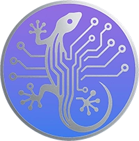

# KARUKIA MCP

<p align="center">
  
</p>

**The complete AI-assisted development methodology, delivered via MCP.**

**Latest: v1.2.3** — Enriched context.json v2 for reliable inter-skill communication.

21 tools, 11 skills, 935+ security/quality/pentest checkpoints. Works with any AI platform (Claude Code, Cursor, Windsurf, Copilot...) through the Model Context Protocol.

## What is KARUKIA?

KARUKIA is a structured development methodology built around specialized AI personas. Each persona (Neo for security, Jeffrey for architecture, Viper for pentesting, Opo for quality...) comes with its own workflow, guard rails, and knowledge base.

When you call a KARUKIA tool, the MCP server returns a complete prompt — persona identity, workflow, checklists, templates — that transforms your AI assistant into that specialist for the session.

```
You: "Run a security audit"
  -> AI calls neo tool
  -> MCP returns full Neo persona prompt + 445 security controls inline
  -> AI becomes Neo, follows the methodology, produces structured findings
```

## The Three Layers

```
Layer 1 - DEFENSIVE (Neo)     445 controls   "Is my code secure?"
Layer 2 - QUALITY (Opquast)   245 rules      "Is my app well-built?"
Layer 3 - OFFENSIVE (Viper)   245 tests      "How would a hacker break in?"
```

---

## Quick Start

**Prerequisites:** [Node.js](https://nodejs.org/) 20 or later.

### Step 1 — Add KARUKIA to your project

Create or edit `.mcp.json` at the root of your project:

```json
{
  "mcpServers": {
    "karukia": {
      "command": "npx",
      "args": ["karukia-mcp"]
    }
  }
}
```

> **Note:** If the file already exists and has other MCP servers, just add the `"karukia"` key inside the existing `"mcpServers"` object.

### Step 2 — Restart your AI client

Restart Claude Code (`/quit` then relaunch) or your IDE. The 21 KARUKIA tools are now available.

> On first launch, `npx` downloads the package automatically (~175 KB). Subsequent launches use the cached version.

### Step 3 — Configure your project

Tell your AI:

> "karukia install"

KARUKIA scans your project, detects your stack, and generates configuration files (security scope, CLAUDE.md, memory structure).

### Step 4 — Start working

Just describe what you need in natural language:

> "karukia: add user authentication"
> "karukia: audit security"
> "karukia: run a pentest"

The orchestrator (`auto`) analyzes your request and routes to the right specialists automatically.

> **Tip:** You only need two commands: `karukia install` (once) then `karukia` + your request (always). For direct control, ask for a specific skill: "karukia neo", "karukia viper", "karukia jeffrey". Say "karukia start" anytime for a full guide.

### Where to put the config

| Client | File | Scope |
|--------|------|-------|
| **Claude Code CLI** | `.mcp.json` at project root | This project only |
| **Claude Code CLI** | `~/.claude.json` (home directory) | All your projects |
| **Claude Desktop** | `claude_desktop_config.json` | Global |
| **Cursor** | `.cursor/mcp.json` at project root | This project only |
| **Windsurf** | MCP settings panel | Global |

---

## Global Installation (optional)

If you want KARUKIA available in all your projects without adding `.mcp.json` each time:

```bash
npm install -g karukia-mcp
```

Then add to your global AI config (`~/.claude.json` for Claude Code):

```json
{
  "mcpServers": {
    "karukia": {
      "command": "karukia-mcp"
    }
  }
}
```

---

## 21 Tools

### Essential (start here)

| Tool | Description |
|------|-------------|
| `install` | **[FIRST STEP]** Configure KARUKIA for your project — run once |
| `auto` | **[MAIN TOOL]** Describe what you need — KARUKIA routes to the right skills |
| `start` | Quick-start guide — explains all skills at 3 progressive levels |

### 11 Skills (AI Personas)

Each skill returns a complete prompt that transforms your AI into a specialist.

| Tool | Persona | What it does |
|------|---------|-------------|
| `neo` | Security Auditor | Defensive audit against 6 frameworks (OWASP, HDS, ISO 27001, SOC 2, PCI-DSS, HIPAA) |
| `viper` | Pentest Brigade | Offensive testing with 16 agents, CVSS v4 scoring, MITRE ATT&CK mapping |
| `jeffrey` | Full-Stack Architect | Feature implementation with TDD and security validation |
| `opo` | Quality Validator | Web quality against 245 Opquast rules |
| `audit_opquast` | Quality Auditor | Deep Opquast compliance audit with 14 thematic checklists |
| `ebios_rm_audit` | Risk Analyst | EBIOS Risk Manager methodology (ANSSI) — formal risk analysis |
| `security_hardening` | Hardening Planner | Security improvement chantiers |
| `terraform_update` | IaC Specialist | Terraform automation for KMS, GCS, IAM |
| `doc_refactor` | Doc Auditor | Documentation accuracy audit vs actual code |

### 5 Utilities

| Tool | Description |
|------|-------------|
| `list_checklists` | Browse all 24 checklists by category |
| `get_checklist` | Retrieve the full content of any checklist |
| `search_rules` | Search across all 935+ checkpoints by keyword and severity |
| `suggest_checklists` | Describe your project — get a prioritized audit plan |
| `generate_report` | Compile audit results into a scored Markdown report |

### 4 Memory & Config

| Tool | Description |
|------|-------------|
| `init_memory` | Initialize KARUKIA memory structure in a project |
| `get_session_template` | Get pre-filled session templates for any skill |
| `get_config_template` | Get configuration templates (security scope, CLAUDE.md, analytics) |
| `get_shared` | Access shared methodology components (guard rules, workflow, agents) |

---

## 24 Checklists

### Defensive Security (Neo) — 6 checklists, 445 controls

| Checklist | Points | Scope |
|-----------|--------|-------|
| **OWASP Security Baseline** | 62 | Every web app |
| **HDS 2.0** | 52 | Health data, France |
| **ISO 27001:2022** | 93 | Enterprise ISMS |
| **SOC 2 Type II** | 74 | SaaS, US market |
| **PCI-DSS v4.0** | 97 | Payment processing |
| **HIPAA** | 67 | Health data, US |

### Web Quality (Opquast) — 14 checklists, 245 rules

Content, personal data, e-commerce, forms, identity, images, internationalization, links, navigation, newsletter, presentation, security UX, server performance, and code structure.

Based on [Opquast](https://www.opquast.com/) — the French web quality reference used by 15,000+ professionals.

### Offensive Security (Viper) — 4 checklists, 245+ tests

| Checklist | Tests | Scope |
|-----------|-------|-------|
| **OWASP WSTG v5** | 100 | Web penetration testing |
| **Cloud Platform** | 80+ | Firebase, GCP, AWS, Azure |
| **Healthcare** | 50+ | PHI, encryption, medical data |
| **Attack Scenarios** | 15+ | PTES templates, MITRE ATT&CK |

---

## Usage Examples

### Full security audit

> "Run a security audit on my project"

Your AI calls `neo` — becomes the Neo security auditor — follows the methodology — produces structured findings with severity, file:line references, and remediation steps.

### Build a feature with guardrails

> "karukia jeffrey: implement user authentication"

Your AI calls `jeffrey` — becomes the Jeffrey architect — implements with TDD, then chains to Neo for security validation (rejection loop: if Neo rejects, Jeffrey fixes, max 3 iterations).

### Pentest your app

> "karukia viper"

Your AI calls `viper` — deploys the Brigade methodology with 16 specialized agents across Recon, Surface Analysis, and Exploitation phases.

### Orchestrate everything

> "karukia: add a logout button and audit security"

Your AI calls `auto` — analyzes the request — routes to the right skill(s) — manages the chain.

---

## Documentation

- [Livre Blanc (Francais)](./LIVRE-BLANC.md) — Document technique detaille : architecture, methodologie, cas d'usage
- [Whitepaper (English)](./WHITEPAPER.md) — Technical deep-dive: architecture, methodology, use cases

---

## Cloud / Enterprise

KARUKIA runs locally by default (stdio via `npx`). Free, zero infrastructure.

**For teams** — a managed KARUKIA server (waitlist): connect your whole team via a single API key, centralized audit trail, consistent checklists across all developers.

→ **contact@karukia.com** to join the waitlist.

---

## About

KARUKIA is developed by **[KARUK IA Solutions](https://karukia.com)**, a B2B SaaS studio specializing in regulated industries (healthcare, finance, pharma), based in Guadeloupe. 🇬🇵

Built from direct experience with HDS 2.0 / ISO 27001 certification in the French healthcare sector. The methodology was made open to share what a real certification process actually requires — not just theory.

> *Made in Guadeloupe — AI doesn't replace the expert, it frees them.*

---

## Why KARUKIA

KARUKIA is a structured AI-assisted development methodology built around three principles:

1. **Separation of concerns** — Security, quality, and implementation are separate disciplines handled by separate AI personas.
2. **Formal checkpoints over gut feeling** — 935 documented checkpoints beat "I think it's fine."
3. **Defense in depth** — Defensive audit first, quality validation second, offensive testing last.

Built from real-world experience securing a healthcare SaaS application to HDS 2.0 / ISO 27001 standards.

---

## License

KARUKIA MCP is free for personal, educational, and internal professional use.

**Commercial use or resale requires written authorization.** Contact: contact@karukia.com

See [LICENSE](./LICENSE) for full terms.
