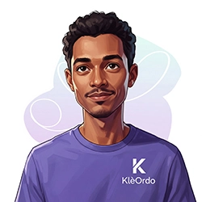

# KARUKIA — Whitepaper

**AI-assisted development methodology: security, quality and pentesting via the MCP protocol.**

*Document in English. Version française : [LIVRE-BLANC.md](./LIVRE-BLANC.md)*

<p align="center">
  
</p>

---

## 1. The Problem

AI assistants (Claude, GPT, Copilot) are powerful but generic. When asked for a security audit, the AI improvises: it knows OWASP concepts but doesn't follow a structured methodology. Results vary from session to session with no guaranteed exhaustiveness.

**Real-world consequences:**

- Vulnerabilities slip through because the AI "forgets" to check certain points
- No traceability: impossible to prove a control was performed
- No reproducibility: two audits of the same code yield different results
- Zero compliance: frameworks (ISO 27001, SOC 2, HDS) require formal evidence

## 2. The KARUKIA Solution

KARUKIA solves this by injecting a **complete methodology** directly into the AI's context, on demand.

### How it works

KARUKIA is an MCP server (Model Context Protocol) — Anthropic's open standard for connecting tools to AI. When the user requests an audit, the MCP server returns a **monolithic prompt** containing:

1. **Persona identity** — name, expertise, communication style
2. **Workflow** — mandatory steps, in order, with validation gates
3. **Checklists** — all relevant control points, inline in the prompt
4. **Templates** — expected output format (tables, scores, verdicts)
5. **Guard rails** — non-negotiable rules (e.g., "every finding must cite file:line")

The AI receives this prompt and **becomes** the specialist for the duration of the session. It cannot "forget" a control — it's written in its context.

### The MCP Protocol

The [Model Context Protocol](https://modelcontextprotocol.io/) is an open standard that allows any AI client to connect to tool servers. KARUKIA works with:

- **Claude Code** (CLI)
- **Claude Desktop**
- **Cursor**
- **Windsurf**
- **Any MCP-compatible client**

Installation is a single line:

```bash
npx karukia-mcp
```

No account, no API key, no data sent externally. The server runs locally on the developer's machine.

---

## 3. Architecture

### Local transport (default)

```
Developer <-> AI Client <-> [stdio] <-> KARUKIA MCP Server (local)
                                            |
                                            ├── 11 skills (prompt builders)
                                            ├── 24 checklists (935+ points)
                                            └── Memory system (sessions, knowledge)
```

The server communicates via **stdio** (standard input/output). No network port opened, no HTTP calls. Everything stays on the local machine.

### Remote transport (enterprise)

```
Team <-> AI Clients <-> [HTTPS] <-> KARUKIA MCP Server (Cloud Run)
                                        |
                                        ├── Bearer auth (MCP_API_KEY)
                                        ├── Per-session rate limiting
                                        ├── Audit trail (Pino logs)
                                        └── Same engine, same checklists
```

For team deployments, KARUKIA supports a **streamable HTTP** transport deployable on your own infrastructure (Cloud Run, Kubernetes, VM). Bearer token authentication, structured logs, rate limiting.

### What the server returns

Each MCP tool returns a **monolithic prompt** — a single text block containing everything the AI needs. No chain of calls, no RAG, no vector database. Just a well-constructed prompt.

Simplified example for `neo` (security audit):

```
[GUARD v2 — non-negotiable obligations]
+
[Neo persona — identity, style, expertise]
+
[Workflow — 5 mandatory steps]
+
[OWASP checklist — 62 inline controls]
+
[ISO 27001 checklist — 93 inline controls]
+
[Output template — table format + verdict]
```

Typical skill prompt size: 15-40 KB depending on active checklists.

---

## 4. The Three Audit Layers

### Layer 1 — Defensive Audit (Neo)

<p align="left">
  
</p>

**Persona:** Neo, senior cybersecurity auditor.

**Method:** Point-by-point verification of each applicable control. Every finding must cite the file and line. Every verdict is either COMPLIANT or NON-COMPLIANT with evidence.

**Supported frameworks:**

| Framework | Controls | Scope |
|-----------|----------|-------|
| OWASP Security Baseline | 62 | Every web app |
| HDS 2.0 | 52 | Health data (France) |
| ISO 27001:2022 | 93 | Enterprise ISMS |
| SOC 2 Type II | 74 | SaaS (US market) |
| PCI-DSS v4.0 | 97 | Payment processing |
| HIPAA | 67 | Health data (US) |

**Output:** Findings table with severity (CRITICAL / MAJOR / MINOR / INFO), checklist reference, file:line, and overall verdict APPROVED or REJECTED.

**Chain:** Neo is systematically called after Jeffrey (implementation) to validate the security of produced code. If Neo rejects, Jeffrey fixes — maximum 3 iteration loop.

### Layer 2 — Quality Audit (Opo / Opquast)

**Persona:** Opo, web quality guardian.

**Method:** Verification of 245 Opquast v5.0 rules across 14 thematic categories. Two modes:

- **opo** — Targeted validation on modified files (fast, before merge)
- **audit_opquast** — Exhaustive audit of all 245 rules (complete, with scoring)

**Categories:** Content, personal data, e-commerce, forms, identification, images and media, internationalization, links, navigation, newsletter, presentation, security UX, server and performance, structure and code.

**Based on:** [Opquast](https://www.opquast.com/) — the French web quality reference used by 15,000+ professionals.

### Layer 3 — Offensive Audit (Viper)

**Persona:** V.I.P.E.R., certified ethical hacker (OSCP, OSCE, OSWE, GWAPT).

**Method:** BRIGADE methodology with 16 specialized agents across 3 phases:

1. **Reconnaissance** (5 agents) — Backend, frontend, config, deps, data
2. **Attack surface** (3 agents) — Control matrix, data flow, STRIDE
3. **Exploit verification** (5-6 agents) — Per OWASP category + cloud + supply chain

**Scoring:** CVSS v4.0 for each finding, MITRE ATT&CK mapping, realistic attack narratives.

**Checklists:**

| Checklist | Tests | Scope |
|-----------|-------|-------|
| OWASP WSTG v5 | 100 | Web penetration testing |
| Cloud Platform | 80+ | Firebase, GCP, AWS, Azure |
| Healthcare | 50+ | PHI, encryption, medical data |
| Attack Scenarios | 15+ | PTES templates, MITRE ATT&CK |

---

## 5. The Orchestrator (Auto)

The `auto` tool is the main entry point. The user describes their request in natural language, and the orchestrator:

1. **Analyzes** the request (type, scope, complexity)
2. **Routes** to the correct skill chain
3. **Manages the rejection loop** (if Neo rejects, Jeffrey fixes, max 3 iterations)
4. **Consolidates** the final report

### Routing table

| Request type | Skill chain |
|-------------|-------------|
| Frontend feature | Jeffrey → Neo → Opo |
| Backend feature | Jeffrey → Neo |
| Bug fix | Jeffrey → Neo |
| Security audit | Neo only |
| Pentest | Viper only |
| Quality audit | audit_opquast only |
| Risk analysis | ebios_rm_audit only |
| Documentation | doc_refactor only |
| Infrastructure | terraform_update → Neo |
| Hardening | security_hardening → Neo |

### Usage

```
"karukia: add user authentication"
    → Jeffrey implements → Neo validates security → Opo checks quality

"karukia: audit the security of my project"
    → Neo audits point by point → structured report

"karukia: run a pentest"
    → Viper deploys 16 agents → CVSS scoring → attack narratives
```

---

## 6. Memory System

KARUKIA maintains a structured memory across sessions:

```
KARUKIA/
└── memory/
    ├── INDEX.md              — Session index
    ├── sessions/             — One session per task
    │   └── YYYY-MM-DD_xxx/
    │       ├── task_plan.md  — Plan and objectives
    │       ├── findings.md   — Discoveries
    │       ├── progress.md   — Progress log
    │       └── context.json  — Machine-readable context
    ├── knowledge/
    │   ├── patterns.md       — Recurring project patterns
    │   └── lessons.md        — Lessons learned
    └── config/
        └── security-scope.md — Active frameworks and constraints
```

This allows KARUKIA to **capitalize** on previous sessions: detected patterns, lessons learned, documented architectural decisions.

---

## 7. For Regulated Industries

### The Real Cost of Certification

Obtaining HDS, ISO 27001, or SOC 2 certification is expensive — not because auditors are incompetent, but because **documentation is missing on audit day**. Evidence is scattered across Jira tickets, emails, and unstructured commits. Fixes were applied in a rush, with no traceability.

**KARUKIA does not replace the human auditor. It prepares the evidence dossier.**

### What KARUKIA Produces for Your Certification

| Auditor's Requirement | What KARUKIA Generates |
|----------------------|------------------------|
| Control evidence | Findings traced with file:line reference |
| Risk mapping | EBIOS RM report (5 ANSSI workshops) |
| Technical security policy | `security-scope.md` generated by `install` |
| Per-framework compliance | Neo reports (HDS, ISO, SOC 2, PCI-DSS…) |
| Remediation history | Structured cross-session memory |
| Documented pentest | Viper report with CVSS v4 + MITRE ATT&CK |

### Why KARUKIA Is Different

| Criterion | Generic Audit Tools | KARUKIA |
|-----------|---------------------|---------|
| Framework coverage | One at a time | 6 frameworks + EBIOS RM in one tool |
| Evidence building | Manual snapshots | Structured cross-session memory |
| Full cycle | Audit only | Code → Security → Quality → Pentest |
| Origin | Theoretical | Built from a real HDS/ISO 27001 certification |
| Web quality | Absent | 245 Opquast rules (French web quality standard) |

### Built from Real Experience

KARUKIA was built from direct experience with HDS 2.0 and ISO 27001 certification in the French healthcare sector. The checklists are not theoretical — they reflect what a real auditor asks, point by point.

---

## 8. Use Cases

### SaaS Startup — SOC 2 compliance

1. `karukia install` — detects stack (React + Node.js + PostgreSQL)
2. `karukia neo` with SOC 2 + OWASP frameworks — full audit
3. Findings become hardening chantiers
4. `karukia jeffrey` implements fixes → Neo revalidates
5. Exportable report for the SOC 2 auditor

### Healthcare Application — HDS certification

1. `karukia install` — detects health data, activates HDS 2.0
2. `karukia neo` with HDS + ISO 27001 frameworks — defensive audit
3. `karukia viper` — healthcare-specific offensive pentest
4. `karukia ebios_rm_audit` — formal ANSSI risk analysis
5. Complete documentation for the certification dossier

### Development Team — continuous quality

1. `karukia install` on the shared project
2. Developers use `karukia: [task]` daily
3. Every feature goes through Jeffrey → Neo → Opo automatically
4. Full audits (`neo`, `viper`, `audit_opquast`) are run periodically

---

## 9. Deployment

### Local — Free (available now)

```bash
npx karukia-mcp
```

Each developer runs the server locally via `npx`. Zero infrastructure, zero cost.

### Team — Managed server (waitlist)

A managed KARUKIA server allows an entire team to connect via a single API key:

- **Consistency** — same checklists for all developers
- **Centralized audit trail** — Pino JSON structured logs
- **Access control** — per-team bearer token
- **Availability** — no dependency on a local machine

> This mode is under development. Join the waitlist: **contact@karukia.com**

---

## 10. Comparison

| Criteria | Generic AI | KARUKIA |
|----------|-----------|---------|
| Methodology | Improvised | 935+ documented controls |
| Reproducibility | Variable | Deterministic (same checklists) |
| Traceability | None | Findings with file:line |
| Compliance | Impossible to prove | Per-framework reports |
| Cost | — | Free (local, npm) |
| Data sent externally | Depends on provider | None (100% local) |
| Installation | — | `npx karukia-mcp` |

---

## 11. About

<p align="left">
  
</p>

KARUKIA is developed by **[KARUK IA Solutions](https://karukia.com)**, a B2B SaaS studio specializing in regulated industries (healthcare, finance, pharma), based in Guadeloupe. 🇬🇵

The KARUKIA methodology is the internal framework used to build and certify SaaS products in HDS 2.0, ISO 27001, and GDPR environments. It is made freely available for personal, educational, and internal professional use.

> *Made in Guadeloupe — AI doesn't replace the expert, it frees them.*

---

## 12. License and Contact

KARUKIA MCP is **free** for personal, educational, and internal professional use. No account required.

Commercial use or resale requires written authorization.

**Contact:** contact@karukia.com

**npm:** [karukia-mcp](https://www.npmjs.com/package/karukia-mcp)

**GitHub:** [github.com/guillaum-h/KARUKIA](https://github.com/guillaum-h/KARUKIA)
